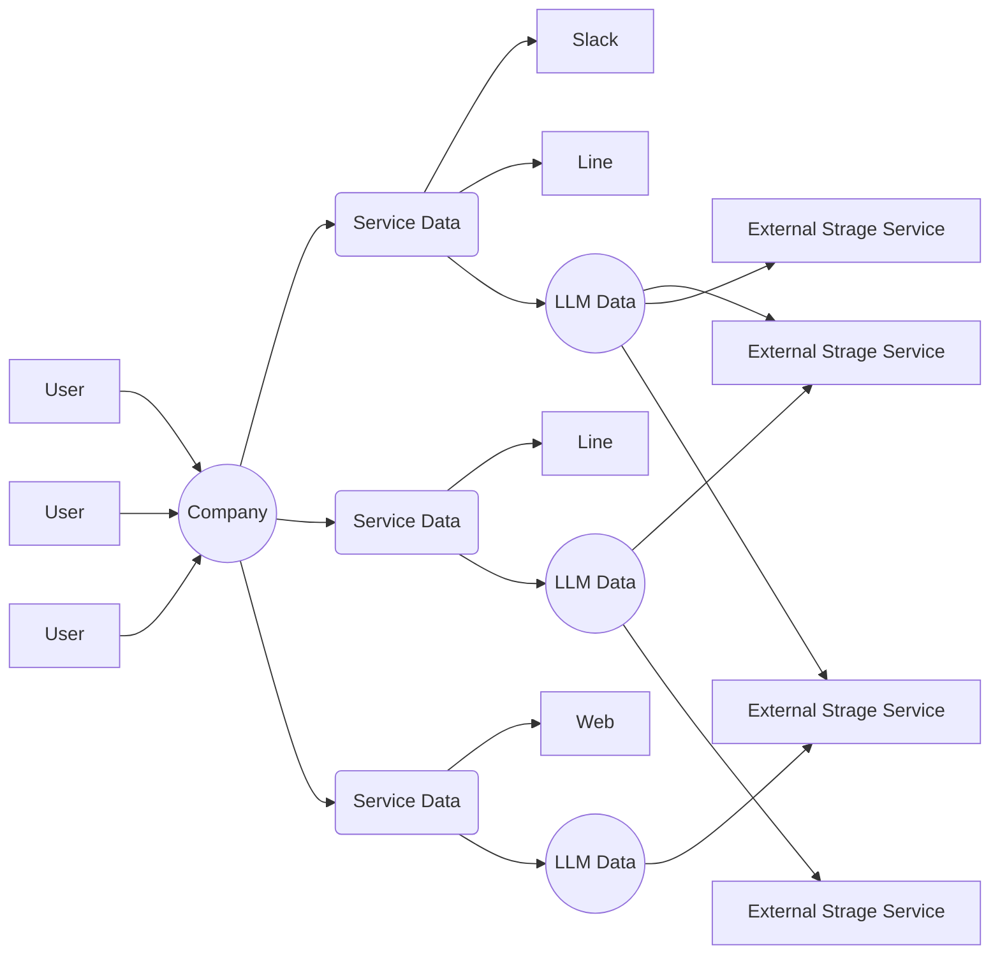

```mermaid
graph LR

    User1[User] --> B((Company))
    User2[User] --> B
    User3[User] --> B
    
    B --> Service1(Service Data)
    B --> Service2(Service Data)
    B --> Service3(Service Data)
    Service1 --> Slack1[Slack]
    Service1 --> Line1[Line]
    Service2 --> Line2[Line]
    Service3 --> Web1[Web]

    Service1 --> LLM1((LLM Data))
    Service2 --> LLM2((LLM Data))
    Service3 --> LLM3((LLM Data))
    
    LLM1 --> Drive1[External Strage Service]
    LLM1 --> Drive2[External Strage Service]
    LLM2 --> Drive1
    LLM2 --> Drive3[External Strage Service]
    LLM3 --> Drive4[External Strage Service]
    LLM1 --> Drive4
```